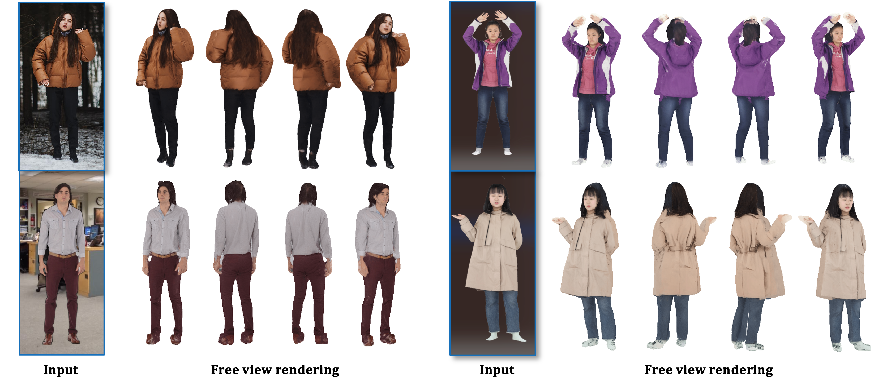
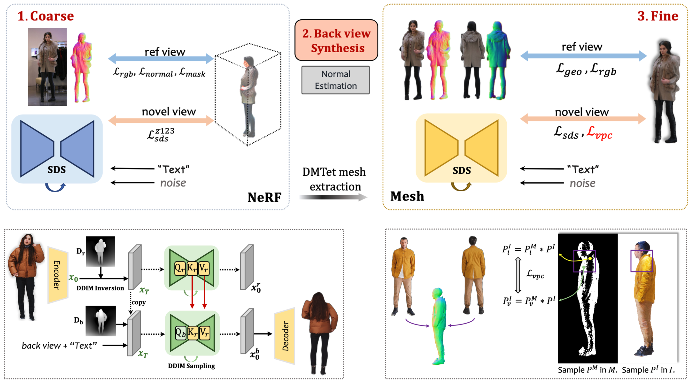

# ConTex-Human

[**Paper**](https://arxiv.org/abs/) | [**Project Page**](https://gaoxiangjun.github.io/contex_human/) 
| [**Youtube video**](https://gaoxiangjun.github.io/contex_human/)

Official implementation of **ConTex-Human**: Free-View Rendering of Human from a Single Image with Texture-Consistent Synthesis. **Code will release.**

[Xiangjun Gao](), [Xiaoyu Li](https://xiaoyu258.github.io/), [Chaopeng Zhang](), [Qi Zhang](https://qzhang-cv.github.io/), [Yanpei Cao](https://yanpei.me/), [Ying Shan](https://scholar.google.com/citations?user=4oXBp9UAAAAJ&hl=en), [Long Quan](https://scholar.google.com/citations?hl=en&user=ZMLhZJ8AAAAJ&view_op=list_works)

**HKUST<sup>1</sup>, Tencent AI Lab <sup>2</sup>**


<p align="center">
    
</p>

**Abstract**: *In this work, we propose a method to address the challenge of rendering a 3D human from a single image in a free-view manner. Some existing approaches could achieve this by using generalizable pixel-aligned implicit fields to reconstruct a textured mesh of a human or by employing a 2D diffusion model as guidance with the Score Distillation Sampling (SDS) method, to lift the 2D image into 3D space. However, a generalizable implicit field often results in an over-smooth texture field, while the SDS method tends to lead to a texture-inconsistent novel view with the input image. In this paper, we introduce a texture-consistent back view synthesis module that could transfer the reference image content to the back view through depth and text-guided attention injection. Moreover, to alleviate the color distortion that occurs in the side region, we propose a visibility-aware patch consistency regularization for texture mapping and refinement combined with the synthesized back view texture. With the above techniques, we could achieve high-fidelity and texture-consistent human rendering from a single image. Experiments conducted on both real and synthetic data demonstrate the effectiveness of our method and show that our approach outperforms previous baseline methods.*

## Comparison with SOTA

<video loop playsinline autoPlay muted controls src="assets/comp_tech.mp4"></video>

## Method Overview
<p align="center">
    
</p>


<!-- https://github.com/MrTornado24/DreamCraft3D/assets/45503891/8e70610c-d812-4544-86bf-7f8764e41067


https://github.com/MrTornado24/DreamCraft3D/assets/45503891/b1e8ae54-1afd-4e0f-88f7-9bd5b70fd44d


https://github.com/MrTornado24/DreamCraft3D/assets/45503891/ead40f9b-d7ee-4ee8-8d98-dbd0b8fbab97 -->


## BibTeX

```bibtex
@article{contex-human,
author    = {Xiangjun Gao and Xiaoyu Li and Chaopeng Zhang and Qi Zhang and Yanpei Cao and Ying Shan and Long Quan},
title     = {Contex-Human},
journal   = {arxiv:2312.},
year      = {2023},
}
```